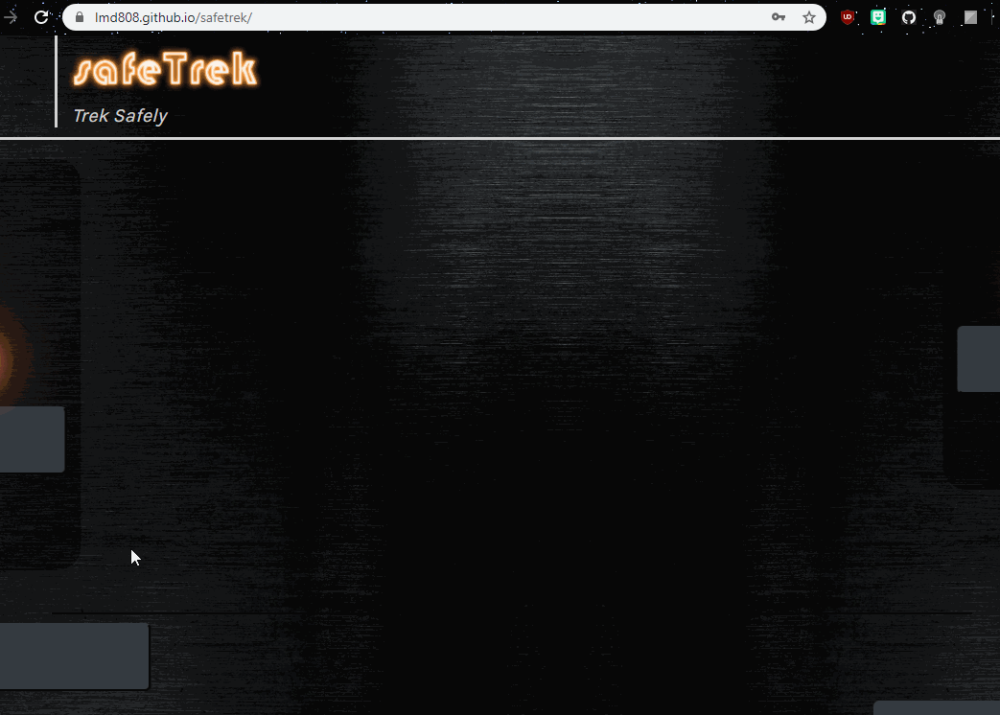
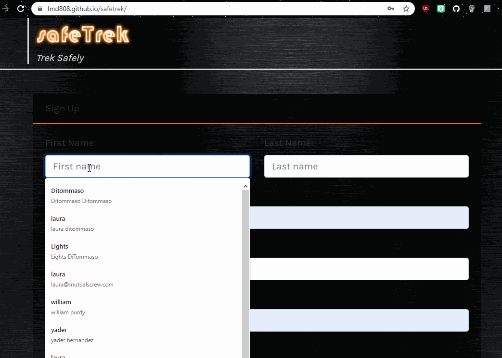
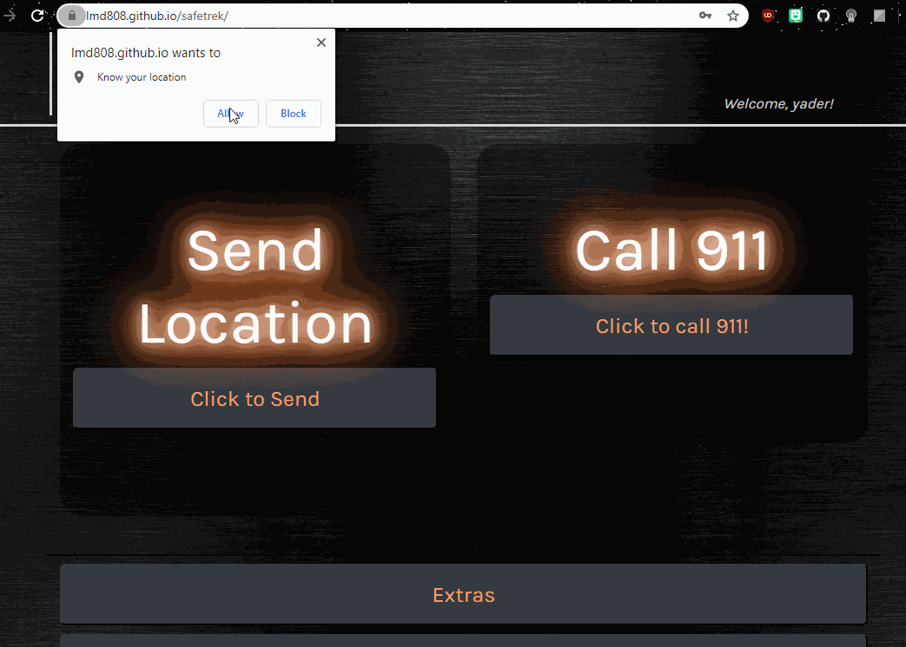
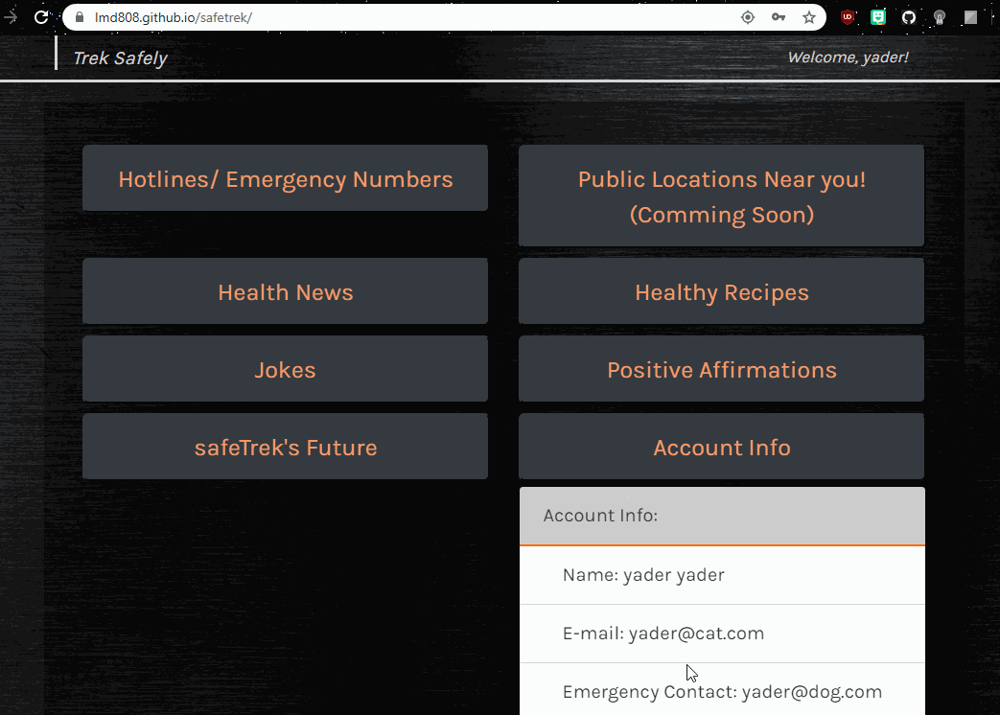

# safeTrek-webversion

## Functionality: 

* Safetrek allows it's users to quickly and safely reach out for help. You're never on your own when you have safeTrek. 

## Local Usage
* Clone this repo to your computer
* Configure local api keys and db connection configuration if necessary/desired 
* Open index.html file in browser
* Enjoy!

## Technologies: 
* [Javascript](https://www.javascript.com/) - The scripting language used to manipulate the DOM. 
* [fireBase] (https://firebase.google.com/)- A cloud hosted real time database 
* [HTML5](https://developer.mozilla.org/en-US/docs/Web/Guide/HTML/HTML5) - Mark up language used for structuring pages. 
* [emailJS](https://www.emailjs.com/)- email service which allows emails to be sent without needing a server
* [BootStrap](https://getbootstrap.com/) - popular framework for building responsive websites
* [BootSwatch](https://bootswatch.com/) - Templating service built on Bootstrap framerwork 
* [CSS](https://developer.mozilla.org/en-US/docs/Web/CSS) -is a stylesheet language used to describe the presentation of a document written in HTML or XML

## Links: 
* Repo: [Git hub Repo](https://github.com/lmd808/safeTrek).
* Deployed  App[Deployed App](https://lmd808.github.io/safetrek/).

# HomePage and Quick Site Demo:  

## Creator: 
Laura DiTommaso
